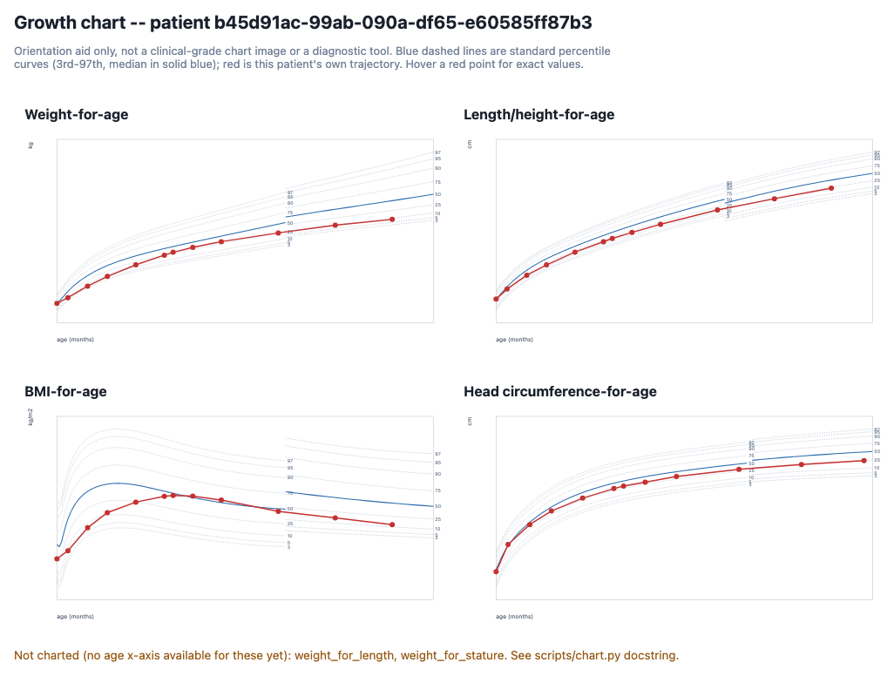

# growth-percentile-skill

[](https://github.com/smallinaUCSD/PediatricPercentileSkill/actions/workflows/ci.yml)
[](LICENSE)
[](CHANGELOG.md)

An open-source **Agent Skill** that computes pediatric growth percentiles
and z-scores from patient measurements, against the CDC and WHO growth
standards — using a frozen, tested, deterministic engine, not model
arithmetic. As far as we've been able to find, it's the first agent-native
(SKILL.md-based) tool for this — everything else in this space is a
library you'd import and write code against.

> Point any coding agent at this repo, hand it a patient's measurements
> (a FHIR bundle or a plain table), and it returns auditable growth
> percentiles with full provenance back to the source data row.



*A real, unedited screenshot of [`scripts/chart.py`](scripts/chart.py)'s
output — see [Visualize it](#visualize-it).*

**New here?** Skip to [Install](#install), then
[get your first result](#get-your-first-result) — no terminal required.

## Install

**Claude Code** (recommended path — tested end-to-end, gives you `/plugin update`):

```
/plugin marketplace add smallinaUCSD/PediatricPercentileSkill
/plugin install growth-percentile@growth-percentile-skill
```

Several other agents ship their own official Agent Skills installer.
This repo's `SKILL.md` sits at the root next to the `scripts/`/`adapters/`
it calls by relative path, so for all of these the skill unit to install
is the **whole repo**, not just the `SKILL.md` file on its own:

- **Codex** — the built-in `$skill-installer`:
  ```
  $skill-installer install https://github.com/smallinaUCSD/PediatricPercentileSkill
  ```
  or clone manually into `~/.agents/skills/growth-percentile` (or
  `.agents/skills/growth-percentile` in a specific project) and restart
  Codex. [Official docs](https://developers.openai.com/codex/skills).
- **OpenCode** — clone into `.opencode/skills/growth-percentile` (project)
  or `~/.config/opencode/skills/growth-percentile` (global). OpenCode also
  scans `.claude/skills/` and `.agents/skills/`, so an install done for
  Claude Code or Codex may already be picked up.
  [Official docs](https://opencode.ai/docs/skills/).
- **Grok Build** — clone into `.grok/skills/growth-percentile` (project) or
  `~/.grok/skills/growth-percentile` (global). Grok Build also automatically
  reads Claude Code plugins/skills with no extra setup, so the Claude Code
  install above may already be enough.
  [Official docs](https://docs.x.ai/build/features/skills-plugins-marketplaces).
- **Hermes** — `hermes skills install smallinaUCSD/PediatricPercentileSkill`
  (or the `/skills install ...` slash command in a chat), or clone manually
  into `~/.hermes/skills/growth-percentile`.
  [Official docs](https://hermes-agent.nousresearch.com/docs/user-guide/features/skills).
- **OpenClaw** — `openclaw skills install git:smallinaUCSD/PediatricPercentileSkill`
  (add `--global` to install into `~/.openclaw/skills` instead of the
  workspace-local `skills/` directory).
  [Official docs](https://docs.openclaw.ai/tools/skills).

**Cursor, or any other coding agent that reads plain markdown:**
[`SKILL.md`](SKILL.md) is a self-contained instruction file — no special
packaging required beyond having the rest of the repo alongside it. For
Cursor: copy this repo in and reference [`SKILL.md`](SKILL.md) as
`.cursor/rules/growth-percentile.md` (or point to its path directly in a
prompt).

We've verified the Claude Code plugin path with a real install/uninstall
cycle. The agent-specific paths above follow each tool's own documented
skill-discovery behavior but haven't been run end-to-end by us against
*this* repo, and the general markdown fallback is untested on other agents
specifically — both should work, but
[let us know](https://github.com/smallinaUCSD/PediatricPercentileSkill/issues)
if one doesn't.

**Cloning the repo directly** is the last-resort path — only needed if
you're developing the skill itself, not using it. See
[CONTRIBUTING.md](CONTRIBUTING.md) if that's you.

Either way, the machine actually running the engine needs
[`uv`](https://docs.astral.sh/uv/) installed — the plugin/skill install
step doesn't bundle a Python environment.

## Get your first result

Once installed, just ask your agent — in plain English, no terminal:

> Using the growth-percentile skill: what percentile is a 9-month-old
> boy at 9.7 kg?

The agent reads [`SKILL.md`](SKILL.md), figures out it needs the
CDC/WHO weight-for-age standard, runs the (fake, made-up-for-this-example)
numbers through the deterministic engine, and comes back with a
percentile, a z-score, which reference standard it used, and any data
quality flags — not a number it computed itself.

Want to see this on a fuller patient record first?
[`demo/warren_synthea.md`](demo/warren_synthea.md) walks through a
complete FHIR bundle end to end, including the automatic WHO→CDC
handoff as the patient ages.

## Bring your own data

The skill accepts two real-world input shapes — tell your agent which one
you have, or just hand it the file and let it figure out which adapter
applies:

| Your data looks like | What happens |
|---|---|
| A FHIR R4 `Bundle` (one `Patient` + `Observation`s) | [`adapters/fhir_r4.py`](adapters/fhir_r4.py) maps it in |
| A spreadsheet / CSV / JSON you already have | [`adapters/flat.py`](adapters/flat.py) — see column spec below |

**Testing or demoing without real patient data?**
[`adapters/synthea.py`](adapters/synthea.py) maps in the CSV export format
produced by [Synthea](https://github.com/synthetichealth/synthea), MITRE's
synthetic-patient generator — entirely fake data, never a real person. It's
what this repo's own tests, evals, and demo (`demo/warren_synthea.md`) run
against, and it's a convenient way to try the skill out before pointing it
at anything real.

For the flat CSV/JSON path, each row/record needs these columns:
`patient_id`, `sex` (`male`/`female`), `birth_date`, `observation_date`,
`metric` (`weight` / `height_standing` / `length_recumbent` /
`head_circumference` / `bmi`), `value`, `unit`. Extra columns your file
happens to have are just ignored.

**If your spreadsheet uses different column names** (e.g. `DOB` instead
of `birth_date`, `Weight (kg)` instead of `value`), you don't need to
rename anything — pass a column map instead:

```bash
uv run adapters/flat.py measurements.csv --map colmap.json
```

where `colmap.json` maps canonical field name → your column name, for
just the columns that differ:

```json
{"birth_date": "DOB", "value": "Weight (kg)"}
```

**Age is configurable both ways:** if you have a birth date and an
observation date, age is derived automatically. If you'd rather supply
age directly (e.g. you've already done a corrected-age calculation for a
preterm infant), add an optional `age_months` column/field and it takes
precedence over the derived value. There's also an optional
`gestational_age_weeks` field for flagging prematurity considerations.
Full field-by-field spec: [`references/CANONICAL_SCHEMA.md`](references/CANONICAL_SCHEMA.md).

## Visualize it

(Example output: the screenshot at the top of this README.)

Ask your agent to chart the results and it can run
[`scripts/chart.py`](scripts/chart.py) on the engine's output: one
self-contained, interactive HTML file per patient (open it in any
browser, no server or internet connection needed), with standard
percentile curves and the patient's own trajectory plotted on top —
weight-for-age, length/height-for-age, BMI-for-age, and
head-circumference-for-age, whichever the patient has data for. It's an
orientation aid, not a clinical-grade chart image, and it doesn't yet
cover weight-for-length/stature (see the script's docstring for why).

## How it works

The math is [Cole's LMS method](references/METHODOLOGY.md) — the same
transform the CDC and WHO use to publish their own growth charts —
implemented once, in a small frozen Python engine
([`scripts/growth.py`](scripts/growth.py)), and never touched by the
model. WHO's 2006 standards are used for ages 0–<24 months, CDC's 2000
charts (plus the 2022 extended-BMI method for severe obesity) for
24 months–20 years, matching CDC/AAP guidance — selected automatically
from the patient's age, not left to the caller to get right.

Full formulas, citations, and edge-case handling (the WHO/CDC boundary,
length-vs-stature, extended BMI, CDC's modified-z-score plausibility
check, prematurity):
[`references/METHODOLOGY.md`](references/METHODOLOGY.md).

## Limitations

This is **v1**. In scope: weight, length/height, BMI, and
head-circumference percentiles, ages 0–20, with automatic WHO/CDC
selection. Deliberately **not** in scope yet, and clearly flagged when
relevant rather than silently approximated:

- Prematurity/gestational-age correction (flagged, not computed)
- Condition-specific charts (Down syndrome, Turner syndrome, etc.)
- Growth velocity / trend analysis across visits
- Weight-for-length/stature charting (numeric output only for those two indicators — see [Visualize it](#visualize-it))

This tool computes percentiles; it does not diagnose, and it is not a
substitute for clinical judgment. It has not been evaluated or cleared
by any regulatory body (e.g. FDA) as a medical device. Percentile
results should be reviewed by a qualified clinician, especially anything
flagged `implausible_value` or `reference_unavailable`.

## Trust and evaluation

- **Golden test suite:** 85 tests, all checked against real CDC/WHO data
  files or CDC's own published worked examples — not invented numbers.
  Frozen and CODEOWNER-protected (`tests/golden/`); see
  [CONTRIBUTING.md](CONTRIBUTING.md).
- **Agent-behavioral eval:** [`EVALUATION.md`](EVALUATION.md) documents
  running real Claude subagents through test scenarios to check whether
  an agent *using this skill* behaves correctly — not just whether the
  engine's math is right. One scenario failed on the first real run (an
  agent hand-computed an out-of-scope number with a caveat attached);
  the fix and re-verification are documented there too.

## Contributing

See [CONTRIBUTING.md](CONTRIBUTING.md) for setup, the PR process, and —
important — which parts of this repo are frozen and require a CODEOWNER
review before you touch them.

## Citation

See [CITATION.cff](CITATION.cff).

## License

MIT — see [LICENSE](LICENSE).
